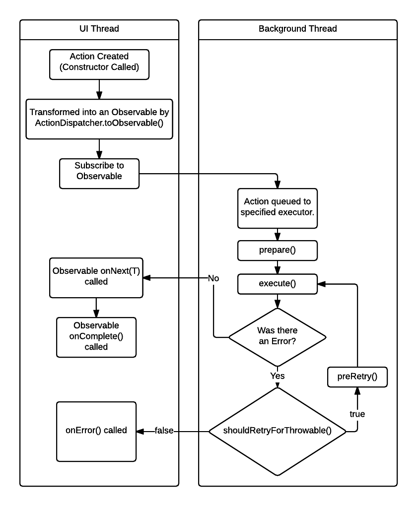

ActionDispatcher
================

### Usage
```groovy
// You need the latest version of RxJava 1.0+, or the latest version of RxAndroid
compile 'io.reactivex:rxandroid:1.1.0'
compile 'io.reactivex:rxjava:1.1.0'

//actiondispatcher-java for java only, actiondispatcher-android for android.
compile 'com.wemakebetterapps:actiondispatcher-android:1.0.0'
```


### Creation

In most cases for Android, the default ActionDispatcher with a few custom components should be enough:

```java
new ActionDispatcher.Builder()
    .withActionLogger(new ActionLogger() {
      @Override public void logDebug(String message) {
        Log.d("ActionDispatcher", message);
      }

      @Override public void logError(Throwable t, String message) {
        Log.e("ActionDispatcher", message, t);
      }
    })
    .build();
```

### Actions

`Action`s are how we divide up our asyncronous work into object oriented, reusable pieces of code.
They have their own lifecycle:



### Injecting Actions

`Action`s can be injected in two different ways. Their is a global approach by providing an 
`ActionPreparer` to the `ActionDispatcher.Builder`. All `Action`s are presented to the provided
`ActionPreparer` before being run. Another alternative that allows you to prepare each `Action`
individually is to override the `Action`#prepare() method. This allows for injecting with 
non-generic dependency injection frameworks like Dagger 2.

### Choosing a Background Thread

A background thread can be selected for an `Action` and overridden in a few different places. Each
`Action` has a `Thread` chosen for it to executed on when it's provided to the `ActionDispatcher`
via a unique `String` key. To customize which key is chosen for each `Action` at a global level, a
`KeySelector` can be provided to the `ActionDispatcher.Builder`. The default `KeySelector` defers 
the choosing of it's thread key to the `Action`#getKey() method which can be overridden for each
`Action` if desired.

The `KeySelector` can be bypassed by providing a key directly to the `toSingle` or `toObservable`
methods.

The `toSingleAsync` or `toObservableAsync` methods can also be used to run the Action on the async
thread key. By default the async thread key differs from the other thread keys by running on an
unbounded cached thread pool.

### Providing Executors

Each unique `String` key corresponds to a specific `Executor` that an action can be run on. By
default, each key corresponds to a single thread executor, except for the async key which runs
`Action`s on an unbounded cached thread pool.

This default behavior can be customized by providing an `Executor` to the `ActionDispatcher.Builder`
via the `withExecutor` method.

Any executor can be accessed directly via the `ActionDispatcher`#getExecutor method.

### Persisting Actions

Certain Actions can be marked as persistent to ensure that they eventually finish running by 
overriding the `Action`#isPersistent method. When taking this approach, an `ActionPersister` must
also be provided at `ActionDispatcher` creation. The provided `AndroidActionPersister` will
handle saving Actions to the Android SQLite database, ensuring they run.